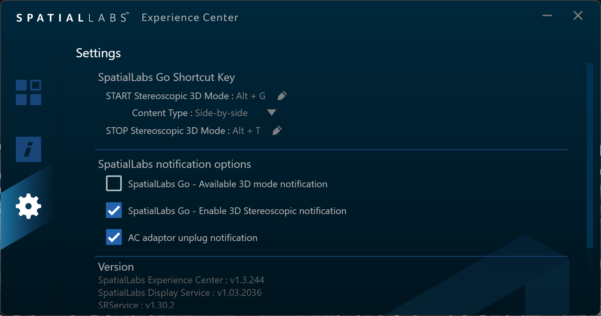
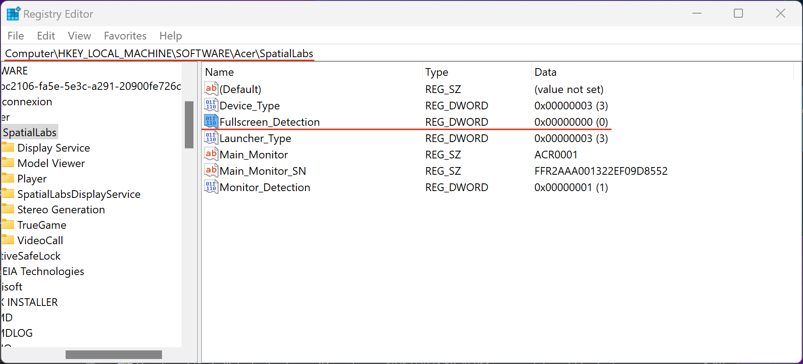
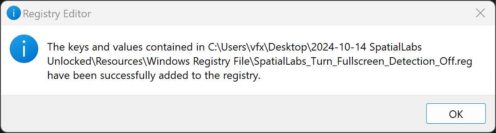
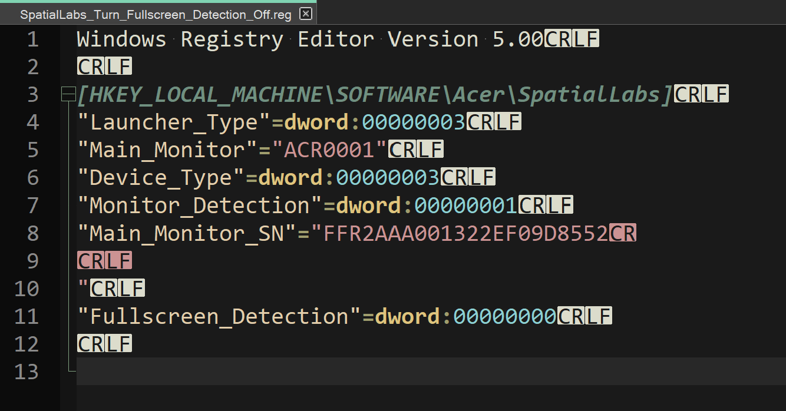
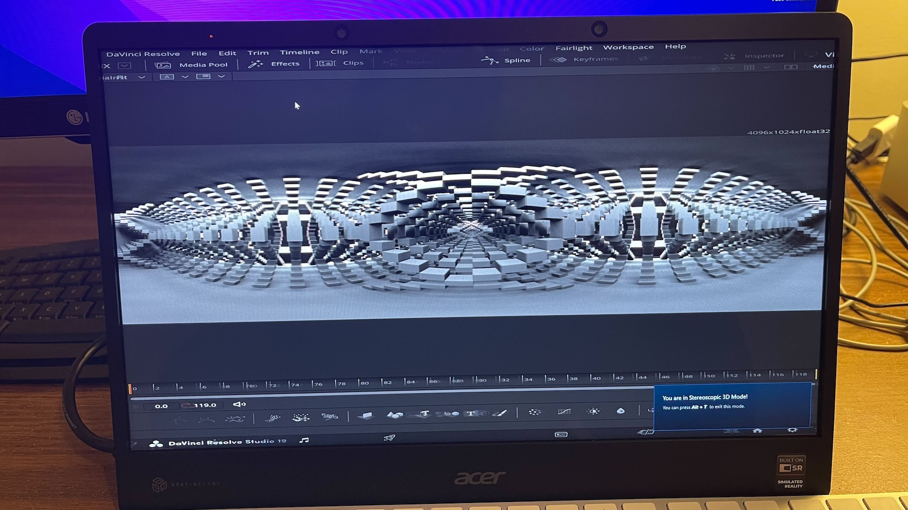
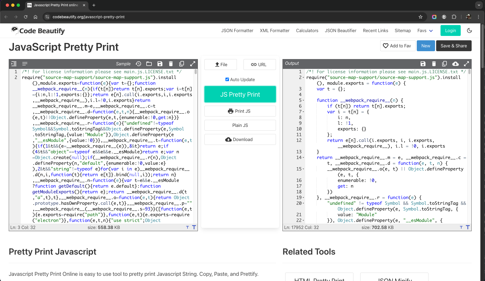
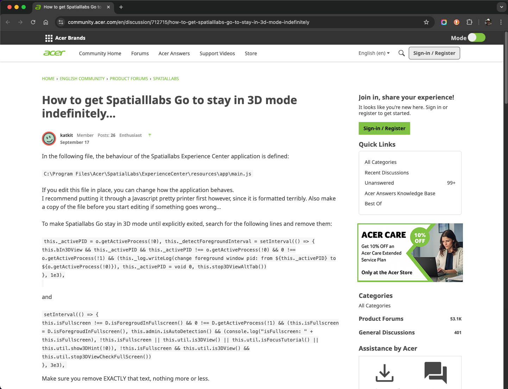
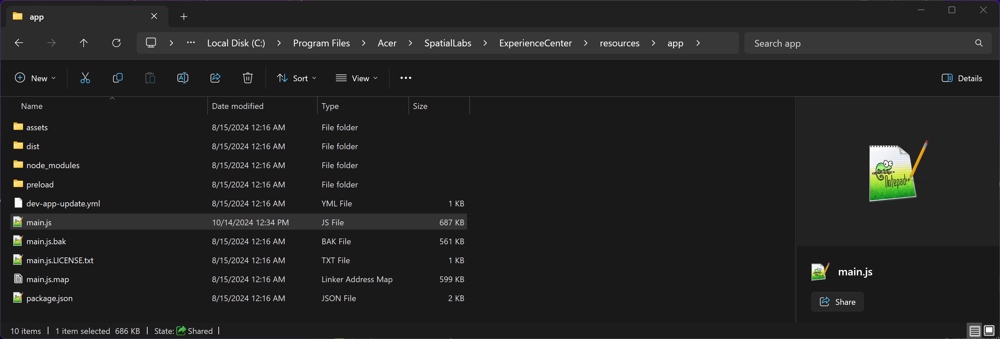

# The SpatialLabs Unlocked Guide

- Document prepared by: Andrew Hazelden
- Information based upon [Acer forum posts](https://community.acer.com/en/discussion/712715/how-to-get-spatialllabs-go-to-stay-in-3d-mode-indefinitely) by user "katkit"  

## Overview

The biggest headache when trying to use an Acer SpatialLabs display, in a post-production environment, is the way the fullsceen mode is enforced and the challenge of keeping the display in the "3D mode" as you switch between apps.

In a stock configuration, it is very hard to use the SpatialLabs display with the common DCC (Digital Content Creation) tools that VFX artists, video editors, and graphic designers use daily.

This guide hopes to assist you solving the biggest user experience issues that an Acer SpatialLabs display presents to broader media & entertainment sector adoption.

## Download Resources

The supporting resources for this guide are available for download:  
- [SpatialLabs_Unlocked.zip](https://kartaverse.github.io/OpenDisplayXR/guides/Acer_SpatialLabs_Display/SpatialLabs_Unlocked.zip) (2.2MB)

## Disable the Fullscreen Detection Feature

The Acer SpatialLabs Experience Center includes a "3D mode" hotkey (Alt+G) that allows you to take an onscreen SBS (Side by Side) formatted fullscreen program's visual content and have it live-weaved into the diagonal interlacing patten the display needs. This "3D mode" is disabled using the (Alt+T) hotkey.

This capability is mentioned in the SpatialLabs Experience Center program if you click the "gear" icon on the left sidebar. You will then see this dialog:

### Patching the Windows Registry

The key usability issue is that the Experience Center program is very picky about the SBS graphics in the running program need to be in a truly fullscreen graphics context without any menus, docked panels, or floating windows.

This makes it challenging if your DCC program that you want to use to display the SBS content is not detected by the Acer Experience Center as being truly fullscreen.

To solve this issue, there is a windows registry setting that controls the SpatialLabs display's fullsceen mode restriction. This preference is what tells the display if the Alt+G hotkey should be allowed to work when you would like to show SBS stereo content on the display using 3rd party apps.

The attribute is stored in the Windows registry at:

		HKEY_LOCAL_MACHINE\SOFTWARE\Acer\SpatialLabs\Fullscreen_Detection

Setting this registry entry to "0" (the number zero) will disable this irritating feature.

There is a new focus detection feature that can be disabled. The attribute is stored in the Windows registry at:

		HKEY_LOCAL_MACHINE\SOFTWARE\Acer\SpatialLabs\Focus_Detection

Setting this registry entry to "0" (the number zero) will disable this  feature as well.

If you double-click on the included "Resources/Windows Registry File/SpatialLabs_Turn_Fullscreen_Detection_Off.reg" windows registry file you can apply the fullscreen detection and focus detection modifications.

If this Widows registry editing process was done correctly, you now have access to a far wider range of stereo 3D compatible DCC programs and media playback tools that can work with the SpatialLabs Display. 

Note: A Windows Regedit based .reg file is a plain-text formatted document. You can open it up in a programmer's text editor like "Notepad++" to view and modify the file contents.

### BMD Resolve Studio

Here is a screenshot of an SBS image displayed in the BMD Resolve Studio "Fusion" page compositing environment with the (Alt+G) 3D mode active. This allows glasses-free stereoscopic SBS media playback in the viewer window:

## Persistent 3D Mode Patch

1. If you want to keep a SpatialLabs Display "locked" into 3D mode, there are several parameters that you can patch. These values are defined in the following javascript file:

		C:\Program Files\Acer\SpatialLabs\ExperienceCenter\resources\app\main.js

	Make a copy of this file in the same folder and call it "main.js.bak". This lets you get back to a factory default setting if anything breaks.

	Note: The "main.js" file is licensed under a BSD open-source license.

2. To make it easier to edit the "main.js" file copy/paste the code "main.js" into an online javascript code reformatting tool like Code Beautify's [Javascript Pretty Print](https://codebeautify.org/javascript-pretty-print) webpage.

After reformatting the text, paste the re-flowed and re-indented javascript code back into the main.js file and save it.

3. If you want to do it manually, the "main.js" patching steps are described in this Acer SpatialLabs Display user post. The thread post "[How to get Spatialllabs Go to stay in 3D mode indefinitely...](https://community.acer.com/en/discussion/712715/how-to-get-spatialllabs-go-to-stay-in-3d-mode-indefinitely)" by the user "katkit" goes over how edit the escape hotkey handling and 3D mode switching javascript code.

Included with the "SpatialLabs Unlocked" guide's ZIP download is a copy of the pre-patched "main.js" file that is ready to use. The file is located at "Resources/Patched SpatialLabs main.js Javascript File/main.js". (A backup version of the unpatched file is included and it is named "main.js.bak".)
	
This patched "main.js" file was tested on October 14, 2024 and it works with SpatialLabs Experience Center v1.3.256 or v1.3.244.

Place a copy of the modified "main.js" file at the location:

		C:\Program Files\Acer\SpatialLabs\ExperienceCenter\resources\app\main.js

4. Restart your system and then launch the SpatialLabs Experience Center app. The display should stay in 3D mode for the rest of your usage session, once you activate it.

5. It is now possible to use either the SpatialLabs Experience Center (Alt+G) hotkey to enable live SBS to weaved output in a persistent fashion. You also have the option of using custom weaving code in a tool like an [OBS Studio](https://obsproject.com/) plugin, or in [Reshade](https://reshade.me/) to do your own direct to weaved rendering path.

