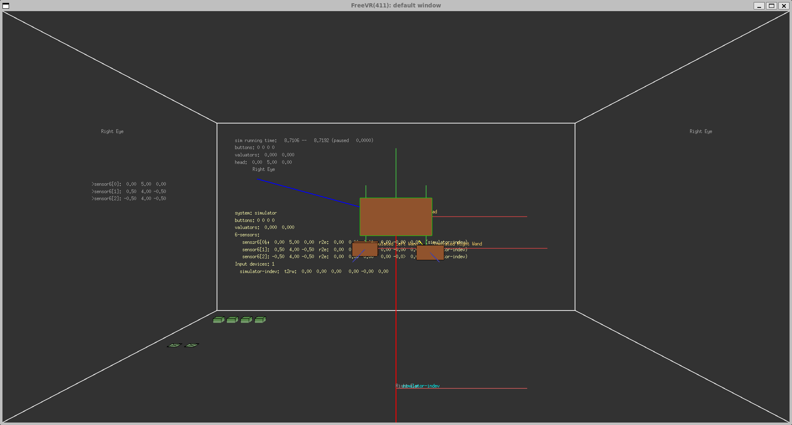

# Build FreeVR on Windows Cygwin

The [Cygwin](https://cygwin.com/) Linux for Windows x64 compatibility tools can be used to compile and run the FreeVR library on a Windows x64 system.

This is an alternative to using the Ubuntu based WSL (Windows Subsystem for Linux) approach to running Linux apps on a Windows PC.

## FreeVR Overview

Bill Sherman's [FreeVR library](https://freevr.org/index.html) provides the features needed to get [VRPN (Virtual-Reality Peripheral Network)](https://github.com/vrpn/vrpn/wiki) sensor data to work with [Monado](https://gitlab.freedesktop.org/monado/monado)'s remote interface. This approach of combining FreeVR and Monado makes it possible to feed haptic input data and motion capture data into the Monado OpenXR session as simulated HMD head pose and hand controller pose data.

## Install Cygwin with make, cmake, etc.

Start by heading over to the [Cygwin project](https://cygwin.com/install.html)'s website to download the Cygwin installer program.

I like to install Cygwin into the folder:

	C:\cygwin64\

For more Cygwin tips check out the [codefull blog post](https://www.codefull.net/2015/12/essential-cygwin-development-packages/) that was a huge help in preparing these notes.

The following Cygwin packages are required to set up the FreeVR build environment:

Devel:
- cmake
- cmake-gui
- gcc-core
- gcc-g++
- gdb
- git
- make

Libs:
- libboost-devel

Python:
- python3

Shells:
- chere (for shell integration)

X11: (Needed for cmake-gui)
- gnu-free-fonts
- xinit

Extras:
- libx11-devel
- libGL-devel
- libGL1
- libXi-devel

extra packages needed:
- cygwin libx11-devel

chere -i -t mintty

# Compiling FreeVR

Start by downloading the latest [FreeVR source code from the project's website](https://freevr.org/downloads.html). At this time of writing this guide the latest version is FreeVR 0.7e.

Cygwin can be started using:
	C:\cygwin64\Cygwin.bat

It's now time to compile FreeVR from source using a Cygwin terminal session:

	$HOME/
	wget http://freevr.org/Downloads/freevr_0.7e.tar.gz
	tar -xvzf freevr_0.7e.tar.gz
	cd $HOME/freevr_0.7e/src
	make cygwin-glx
	cp configurator eviotest joytest balltest cgtest dtracktest fastraktest magtest orbtest pinchtest vrpntest vruiddtest fobtest inputs travel $HOME/freevr_0.7e/bin/

## FreeVR Compiler Issues

### Lib X11

To solve this compile issue libx11-devel is required:

    vr_visren.glx.c:63:10: fatal error: X11/keysym.h: No such file or directory
       63 | #include <X11/keysym.h>         /* needed for Keysym material */
          |          ^~~~~~~~~~~~~~

Stackoverflow had a tip that [related to the underlying x11 issue](https://stackoverflow.com/questions/64191271/is-there-a-way-to-use-x11-xlib-h-and-x11-keysym-h-with-mingw).

### OpenGL GLX

In the file included from vr_visren.glx.c:67:

    vr_visren.glx.h:18:10: fatal error: GL/glx.h: No such file or directory
       18 | #include <GL/glx.h>             /* needed for many many things, also includes lots of X11 stuff */

Stackoverflow had a tip that [related to the underlying Cygwin OpenGL issue](https://stackoverflow.com/questions/14344/starting-off-with-opengl-under-cygwin).

    gcc -DWIN_GLX -DSHM_DUMMY -DSHM_SVR4MMAP -DSEM_POSIX -DMP_PTHREADS -g -DHOST='"R4 (CYGWIN_NT-10.0-22631 3.5.3-1.x86_64)"' -DARCH='"cygwin-glx"' -I/usr/X11R6/include -o travel travel.o drawing.o -L. -lfreevr -L/usr/X11R6/lib -lGL -lX11 -lXi -lm

### Lib Xi

/usr/lib/gcc/x86_64-pc-cygwin/11/../../../../x86_64-pc-cygwin/bin/ld: cannot find -lXi: 

    No such file or directory
    collect2: error: ld returned 1 exit statu

To solve this issue:

    inputs.exe: missing "cyggl-1.dll" "cygX11-6.dll" "cygwin1.dll"

The following webpages had tips that helped with the dll issues:

- https://github.com/BackupTheBerlios/glui-ng
- https://cygwin.com/pipermail/cygwin-xfree/2010-January/034098.html
- http://x.cygwin.com/docs/faq/cygwin-x-faq.html 
- https://x.cygwin.com/docs/ug/cygwin-x-ug.html
- https://x.cygwin.com/docs/ug/using.html#using-starting-exe

## Running FreeVR in an x11 session

Run the following commands in a Cygwin terminal session to launch the FreeVR inputs program:

	cd $HOME/freevr_0.7e/bin/
	startxwin
	./inputs

You can also run the FreeVR vrpntest program in a Cygwin terminal session:

	cd $HOME/freevr_0.7e/bin/
	startxwin
	./vrpntest [-screen|-csv] [-list|-nodata|-once|-1] [-p <port>(3883)] [<VRPN host> (default = 'localhost')]
