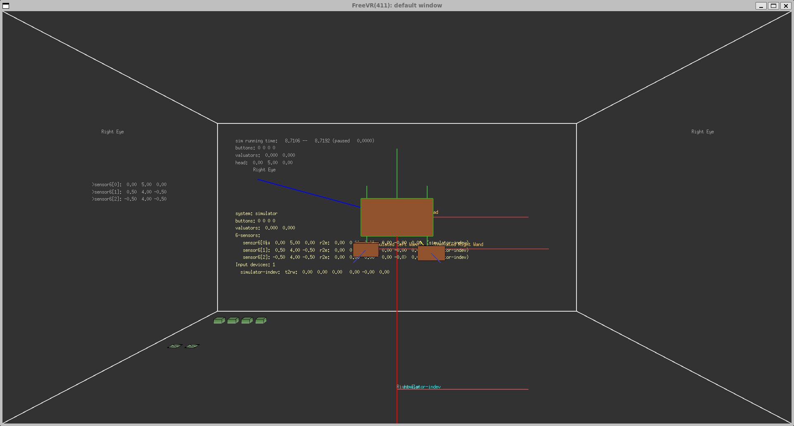

# Build FreeVR on Windows WSL

The Windows's WSL (Windows Subsystem for Linux) feature can be used to compile and run the FreeVR library.

Windows WSL Docs:

- [WSL Install](https://learn.microsoft.com/en-us/windows/wsl/install)
- [WSL Environments](https://learn.microsoft.com/en-us/windows/wsl/setup/environment)
- [WSL Gui-Apps](https://learn.microsoft.com/en-us/windows/wsl/tutorials/gui-apps)

## FreeVR Overview

Bill Sherman's [FreeVR library](https://freevr.org/index.html) provides the features needed to get [VRPN (Virtual-Reality Peripheral Network)](https://github.com/vrpn/vrpn/wiki) sensor data to work with [Monado](https://gitlab.freedesktop.org/monado/monado)'s remote interface. This approach of combining FreeVR and Monado makes it possible to feed haptic input data and motion capture data into the Monado OpenXR session as simulated HMD head pose and hand controller pose data.

## Installing WSL

To install WSL you require Windows 10 version 2004+ (Build 19041 and higher), or Windows 11. Also, your PC's BIOS settings need to have CPU virtualization enabled.

Open the Command Prompt in administrator mode. Then run:

	wsl --install

Windows Subsystem for Linux and Ubuntu will be installed. Restart the computer after the installation is complete.

Open the Windows start menu. Click on the new entry for "Ubuntu".

You will be asked to create a new username for the WSL account:

	"Enter new UNIX username:"

Also you will need to define a password for this WSL account:

	"New password:"

You will then see the text:

	Installation successful!
	To run a command as administrator (user "root"), use "sudo <command>".
	See "man sudo_root" for details.

	Welcome to Ubuntu 22.04.3 LTS (GNU/Linux 5.15.146.1-microsoft-standard-WSL2 x86_64)
	
	 * Documentation:  https://help.ubuntu.com
	 * Management:     https://landscape.canonical.com
	 * Support:        https://ubuntu.com/advantage

	This message is shown once a day. To disable it please create the
	/home/vfx/.hushlogin file.

Its time to upgrade the included Ubuntu packages:

	sudo apt update && sudo apt upgrade

The Linux files can be accessed in Windows Explorer using the filepath of:

	\\wsl.localhost\Ubuntu

Install the GNOME text editor:

	sudo apt install gnome-text-editor -y

Install X11 apps:

	sudo apt install x11-apps x11-xserver-utils -y

Install MESA graphics support:

	sudo apt install mesa-utils

Restart Windows again to allow the X11 GUI apps to work in WSL.

Run the glxgears utility to test the X11 window manager support:

	glxgears

## Troubleshooting WSL vGPU issues:

The following WSL vGPU articles provide inside into WSL graphics support:

- https://github.com/microsoft/wslg/discussions/78
- https://github.com/microsoft/wslg

## Add WSL Compiler Support

Install the Linux compiling tools:

	sudo apt install g++ gcc cmake git git-lfs ninja-build

## Compiling FreeVR

It's now time to compile FreeVR from source using a terminal session:

	$HOME/
	wget http://freevr.org/Downloads/freevr_0.7e.tar.gz
	tar -xvzf freevr_0.7e.tar.gz
	cd $HOME/freevr_0.7e/src
	make linux2.6pt-glx-64
	cp configurator eviotest joytest balltest cgtest dtracktest fastraktest magtest orbtest pinchtest vrpntest vruiddtest fobtest inputs travel $HOME/freevr_0.7e/bin/

## Running FreeVR

Run the following commands in a WSL terminal session to launch the FreeVR inputs program:

	cd $HOME/freevr_0.7e/bin/
	./inputs

You can also run the FreeVR vrpntest program in a WSL terminal session:

	cd $HOME/freevr_0.7e/bin/
	./vrpntest [-screen|-csv] [-list|-nodata|-once|-1] [-p <port>(3883)] [<VRPN host> (default = 'localhost')]

