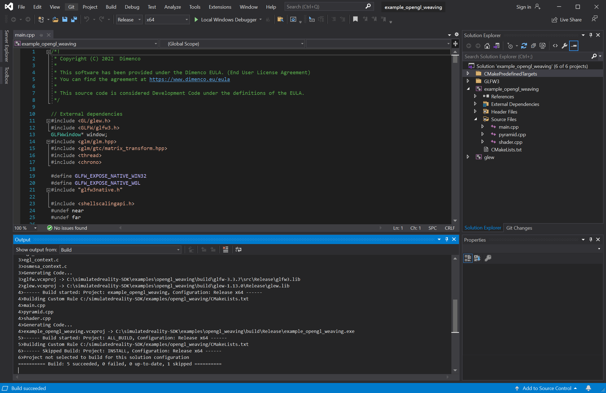
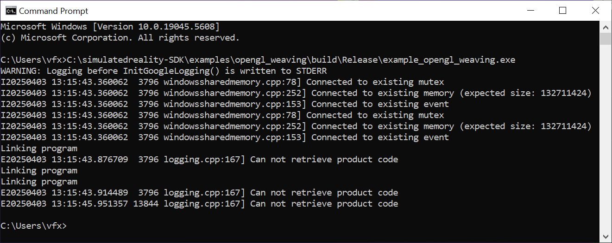
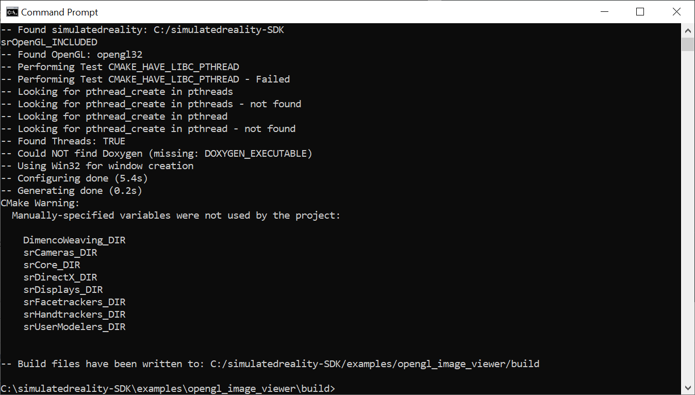
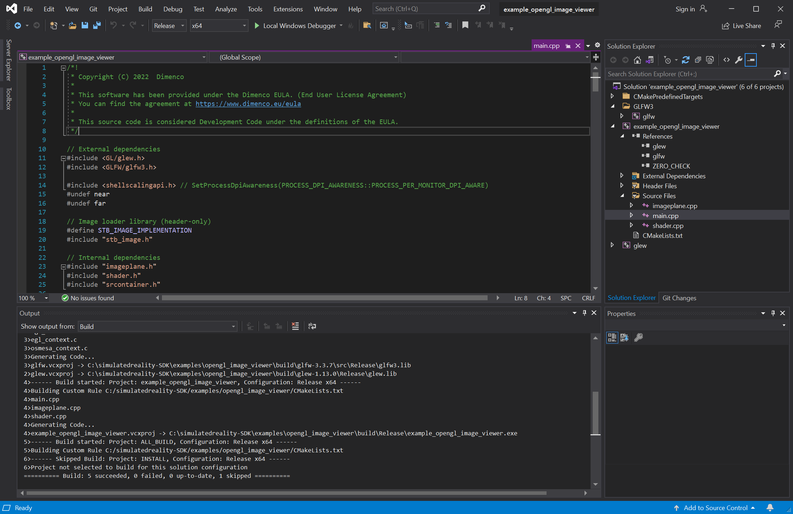
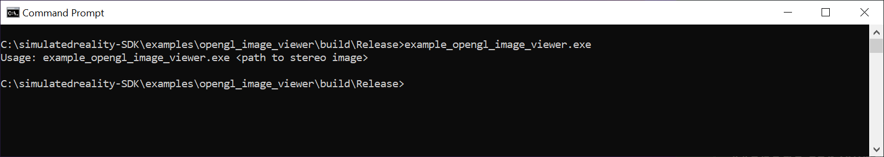

# Leia SR SDK Usage Guide

Last Updated: 2025-04-03 01.05 PM   
Written by: Andrew Hazelden <andrew@andrewhazelden.com>  

Step 1. Download the Spatial Reality SDK from the project's [GitHub Releases page](https://github.com/LeiaInc/LeiaSR-Windows-Releases/releases).

Expand the zip archive contents to the root folder of the C:\ drive and rename the folder to "simulatedreality-SDK":

    C:\simulatedreality-SDK\

(This folder name choice will keep the filepaths simple when compiling the code.)

SDK Reference URLs:

- [Leia SDK](https://support.leiainc.com/sdk)
- [SRSDK](https://leiainc.github.io/SRSDK-Doxygen-Documentation/)
- [SRSDK OpenGL Weaving](https://leiainc.github.io/SRSDK-Doxygen-Documentation/opengl_weaving.html)
- [3DGameBridgeProjects](https://github.com/LeiaInc/3DGameBridgeProjects)
- [3DGameBridge](https://github.com/BramTeurlings/3DGameBridge/issues/76)

Step 2. [Download the cmake program](https://cmake.org/download/). When installing cmake, be sure to enable the installer checkbox option that adds cmake to the system path environment variable.

Step 3. Install Visual Studio Community Edition:

Download the [Visual Studio 2019 community installer](https://aka.ms/vs/16/release/vs_community.exe). After running the Visual Studio installer, select the "Desktop development with c++" option.

* * * * * * * * * * * * * * * * * * * * * * * * * * * * * * * * * * * * 

Step 4. Create the Visual Studio solution for the "OpenGL Weaving" demo using cmake from the command prompt:

Enter the following shell commands:

    cd C:\simulatedreality-SDK\examples\opengl_weaving
    mkdir build
    cd build
    explorer .
    cmake -G"Visual Studio 16 2019" -A"x64" -T"v142" -D"DimencoWeaving_DIR=C:\simulatedreality-SDK\lib\cmake\DimencoWeaving" -D"simulatedreality_DIR=C:\simulatedreality-SDK\lib\cmake\simulatedreality" -D"srCameras_DIR=C:\simulatedreality-SDK\lib\cmake\srCameras" -D"srCore_DIR=C:\simulatedreality-SDK\lib\cmake\srCore" -D"srDirectX_DIR=C:\simulatedreality-SDK\lib\cmake\srDirectX" -D"srDisplays_DIR=C:\simulatedreality-SDK\lib\cmake\srDisplays" -D"srFacetrackers_DIR=C:\simulatedreality-SDK\lib\cmake\srFacetrackers" -D"srHandtrackers_DIR=C:\simulatedreality-SDK\lib\cmake\srHandtrackers" -D"srOpenGL_DIR=C:\simulatedreality-SDK\lib\cmake\srOpenGL" -D"srUserModelers_DIR=C:\simulatedreality-SDK\lib\cmake\srUserModelers" ..

Step 5. Compile the code in Visual Studio

    start example_opengl_weaving.sln

Change the build output from "Debug" to "Release". Then select the "Build > Build Solution" menu item.

The compiled output can be found on disk at:

    C:\simulatedreality-SDK\examples\opengl_weaving\build\Release\

* * * * * * * * * * * * * * * * * * * * * * * * * * * * * * * * * * * * 

Step 6. Create the Visual Studio solution for the "OpenGL Image Viewer" demo using cmake from the command prompt:

Enter the following shell commands:

    cd C:\simulatedreality-SDK\examples\opengl_image_viewer
    mkdir build
    cd build
    explorer .
    cmake -G"Visual Studio 16 2019" -A"x64" -T"v142" -D"DimencoWeaving_DIR=C:\simulatedreality-SDK\lib\cmake\DimencoWeaving" -D"simulatedreality_DIR=C:\simulatedreality-SDK\lib\cmake\simulatedreality" -D"srCameras_DIR=C:\simulatedreality-SDK\lib\cmake\srCameras" -D"srCore_DIR=C:\simulatedreality-SDK\lib\cmake\srCore" -D"srDirectX_DIR=C:\simulatedreality-SDK\lib\cmake\srDirectX" -D"srDisplays_DIR=C:\simulatedreality-SDK\lib\cmake\srDisplays" -D"srFacetrackers_DIR=C:\simulatedreality-SDK\lib\cmake\srFacetrackers" -D"srHandtrackers_DIR=C:\simulatedreality-SDK\lib\cmake\srHandtrackers" -D"srOpenGL_DIR=C:\simulatedreality-SDK\lib\cmake\srOpenGL" -D"srUserModelers_DIR=C:\simulatedreality-SDK\lib\cmake\srUserModelers" ..

Step 5. Compile the code in Visual Studio

    start example_opengl_image_viewer.sln

Change the build output from "Debug" to "Release". Then select the "Build > Build Solution" menu item.

The compiled output can be found on disk at:

    C:\simulatedreality-SDK\examples\opengl_image_viewer\build\Release\

When you run the example_opengl_image_viewer.exe program the syntax is:

    example_opengl_image_viewer.exe "C:\Path\To\image.png"

