# Monado for Windows Based OpenXR Virtual Devices

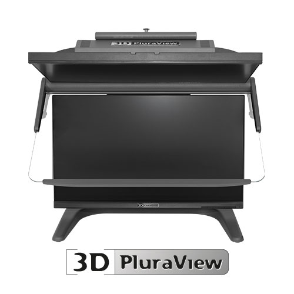

The open-source [Monado](https://monado.dev/) framework makes it possible to display OpenXR rendered real-time stereoscopic 3D content on a passive stereoscopic 3D monitor like the Schneider Digital [PluraView3D display](https://www.3d-pluraview.com/en/). Monado is cross-platform compatible and works on both Windows and Linux systems. 

The image below shows the Monado output from the bundled Khronos "Hello XR" program that is included with the [Khronos OpenXR-SDK](https://github.com/KhronosGroup/OpenXR-SDK-Source).

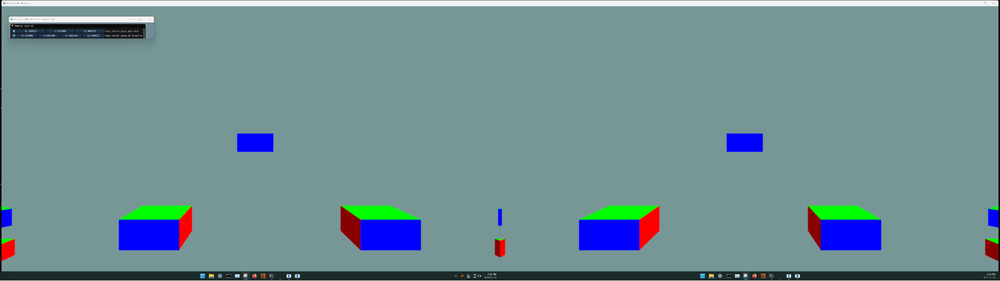

The NVIDIA Neural Graphics Primitives NeRF program running with OpenXR output on a PluraView3D monitor is shown below:

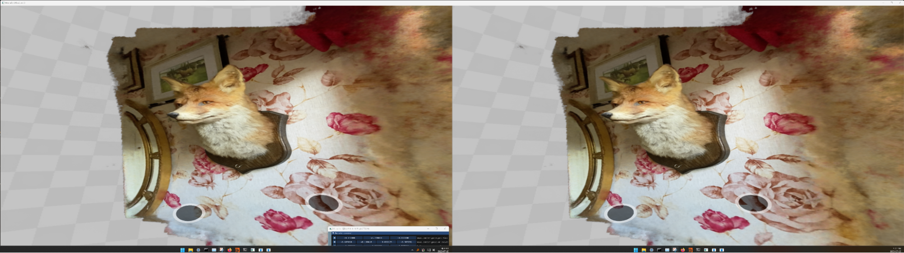

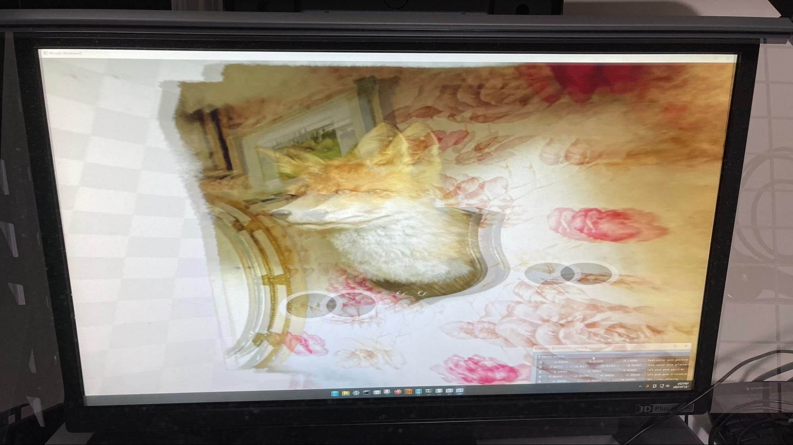

At the moment the virtualized OpenXR stereoscopic 3D rendering is achieved using an extended desktop based output mode. The two PluraView3D display panels need to be arranged in a horizontal layout in the Windows operating system's "System \> Display" settings. You can flip the left and right eye ordering by re-positioning display 1 and 2\.

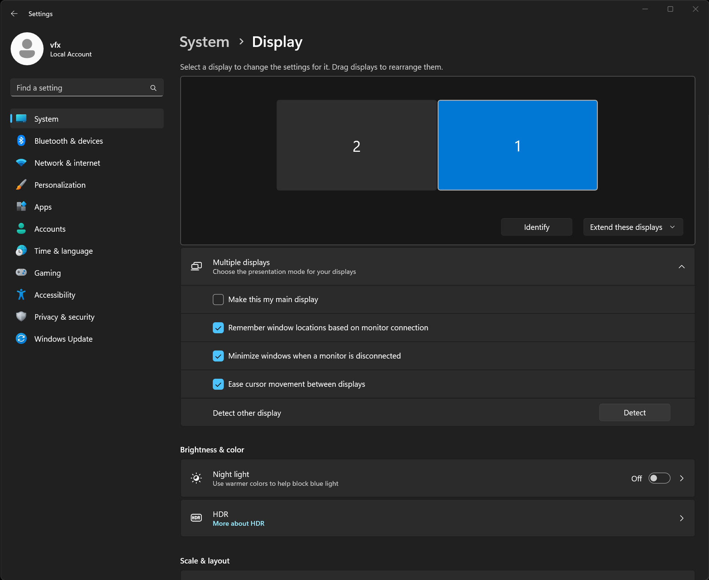

In the future a Vulkan based QuadBuffer stereo output mode would be possible with the addition of a new [XRT compositor](https://monado.pages.freedesktop.org/monado/group__comp.html) definition.

## Using Monado

### Controlling the Camera

For this initial PluraView3D based OpenXR demonstration we are relying on a Monado "remote" OpenXR simulator mode that displays a windowed stereoscopic 3D graphics context. This output is configured through the use of a JSON based configuration file, and environment variables.

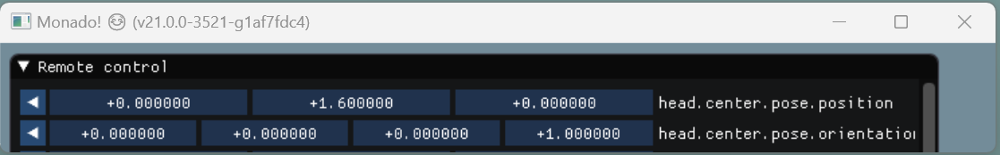

The "remote control" user interface has a lot of OpenXR based input settings that can be adjusted. We are primarily focused on the first two controls that adjust the virtual camera's position and orientation:  

- head.center.pose.position  
- head.center.pose.orientation

The position (XYZ translation) and orientation (rotation) controls in the remote control window allow the use of a mouse to mimic the motion of a simulated head mounted display's 6DoF positional tracking sensor.

Tip: When using the Remote Control window, it is helpful to manually resize the bottom-right corner of the window smaller so the view shows only the position and orientation controls. This makes things easier on an extended desktop based monitor setup.

It is possible to define custom tracking devices with Monado. Down the road, hardware like a 3Dconnexion Space Mouse Enterprise could be used to control the OpenXR camera position.

## Install OpenDisplayXR

1\. Go to the [OpenDisplayXR repo on GitHub](https://github.com/Kartaverse/OpenDisplayXR/), and download the zipped archive from the Releases page.

The zip file can be expanded to a folder location of your choice on your hard disk. A default location would be to place the expanded folder on disk at:  

	C:\OpenDisplayXR\

2\. The NVIDIA InstantNGP NeRF program for Windows can be downloaded from the following GitHub link:  
[https://github.com/NVlabs/instant-ngp\#installation](https://github.com/NVlabs/instant-ngp#installation)

Place the expanded InstantNGP NeRF program on disk at:  

	C:\Instant-NGP\

3\. The 3Dconnexion Space Mouse 3DxWare compatible "3DxMonado.3dxz" preset can be downloaded from the OpenDisplayXR repo's extras folder.

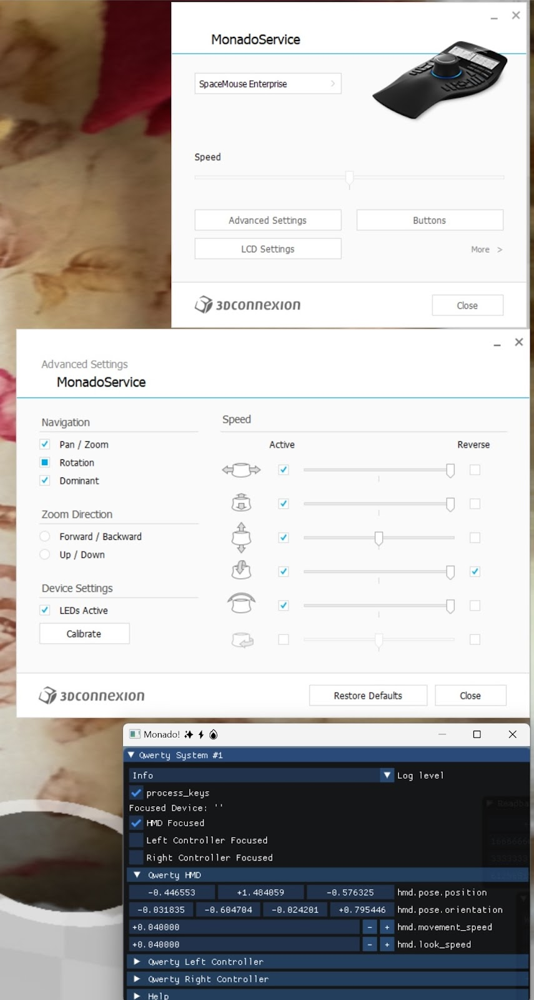

## PluraView3D OpenXR Demo Content

Inside the Monado folder you will see a "bin" folder that holds the Monado libraries, several .bat scripts, and a configuration file in JSON format.

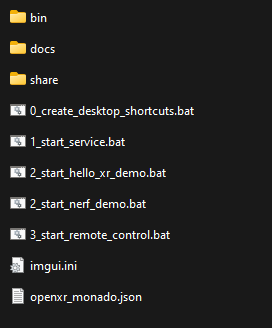

I created several .bat scripts to streamline the process of launching the OpenXR Monado service, the remote control GUI, and a sample Khronos group produced OpenXR program called "Hello XR" that displays several colourful cubes in a stereoscopic 3D environment.

When you want to try out Monado, simply run the scripts in the following order:

* 1\_start\_service.bat  
* 2\_start\_hello\_xr\_demo.bat    or     2\_start\_nerf\_demo.bat  
* 3\_start\_remote\_control.bat

The "0\_create\_desktop\_shortcuts.bat" script creates a desktop folder and start menu based shortcuts for the included tools.

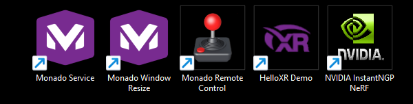

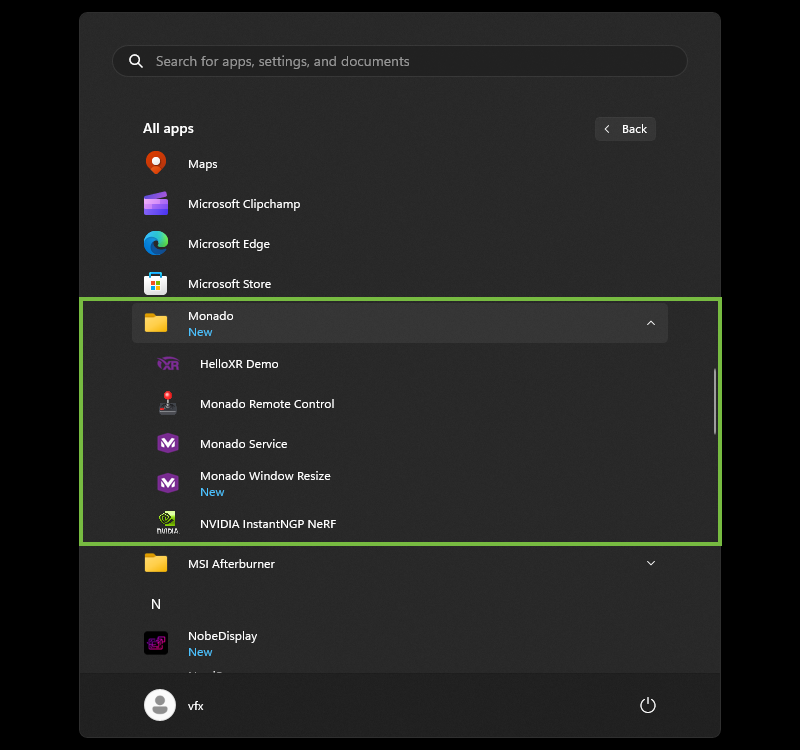

The "1\_start\_service.bat" script enables the Monado service that registers itself as an OpenXR based virtual HMD known as a "remote" simulator.

The "2\_start\_hello\_xr\_demo" script starts a Khronos Group provided sample OpenXR program "Hello XR". The Hello XR demo is set to render the stereoscopic footage using Vulkan graphics. The Monado simulator window is resized to fit the dual monitor layout "extended desktop" screen size.

The "2\_start\_nerf\_demo.bat" script starts the NVIDIA InstantNGP NeRF rendering program in the OpenXR based VR mode. The [pre-compiled InstantNGP program](https://github.com/NVlabs/instant-ngp#installation) needs to be manually downloaded and installed to "C:\\Instant-NGP\\instant-ngp.exe".

The "3\_start\_remote\_control" script displays a Monado utility window. Click the "Remote" button in this window to display the Remote Control.

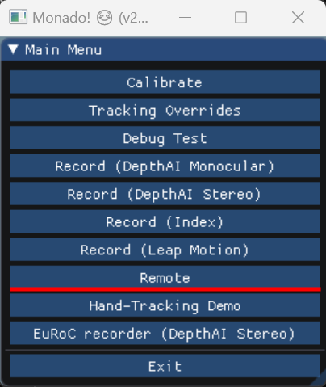

Then press the "Connect" button to connect to the active OpenXR session. You can then move the VR camera view around using your mouse. It is useful to scale the borders of the Remote Control window down in size so it takes up less space on the monitor.

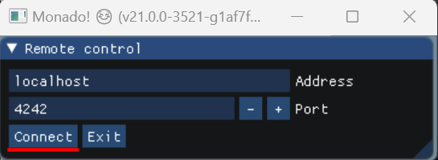

An interesting feature of the Remote Control window is you can use an IP based network computer connection to drive the OpenXR session externally.

## OpenDisplayXR Executables

Inside the OpenDisplayXR "bin" folder you will see several executables:  
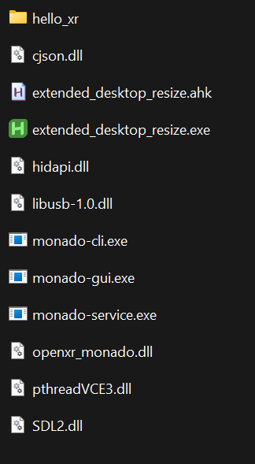

The Monado runtime has three executables called "monado-cli.exe", "monado-gui.exe", and "monado-service.exe". There are several supporting .dll libraries.

## Environment Variables

If you want to have the Monado environment variables accessible system-wide you can add the following two entries to your Windows operating system's list of active environment variables:

	XR_RUNTIME_JSON=C:\OpenDisplayXR\openxr_monado.json  
	P_OVERRIDE_ACTIVE_CONFIG=remote  

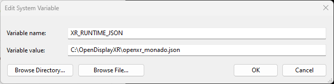

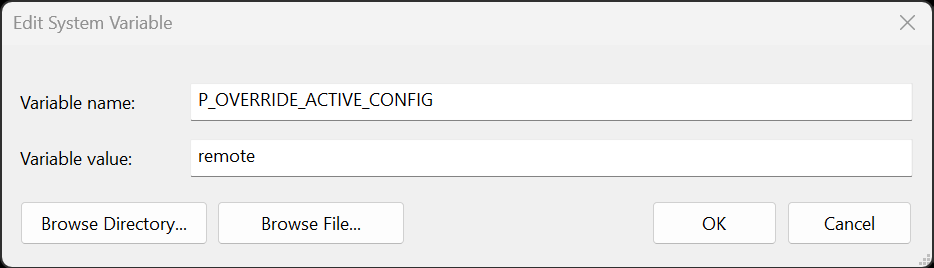

## Resizing the Graphics Context

To make it easier to accurately position the Monado graphics context on a dual monitor PluraView3D display, I created a simple script called "extended\_desktop\_resize". This script was written using a toolset called [AutoHotkey](https://www.autohotkey.com/). The script checks the combined resolution of the two monitor displays and scales the Monado window to that exact size.

For completeness, here is an inline copy of the "extended\_desktop\_resize.ahk" script code:  

	#Requires AutoHotkey v2.0  
	#SingleInstance
	
	; Resize the Monado window to fit across a dual monitor extended desktop configuration  
	WinWait("ahk_class Monado")  
	VirtualScreenWidth := SysGet(78)  
	VirtualScreenHeight := SysGet(79)  
	WinMove 0, 0, VirtualScreenWidth, VirtualScreenHeight, "ahk_class Monado"

This script is compiled by AutoHotkey into an executable named "extended\_desktop\_resize.exe". The executable is run automatically by the "2\_start\_hello\_xr\_demo.bat" and " 2\_start\_nerf\_demo.bat" scripts so it will resize the graphics context as soon as the OpenXR window is created.

## Bat Scripts

Several launcher scripts are included with OpenDisplayXR. These scripts are called by  desktop and start menu shortcuts.

- 0\_create\_desktop\_shortcuts.bat
- 1\_start\_service.bat
- 2\_start\_hello\_xr\_demo.bat
- 2\_start\_nerf\_demo.bat
- 3\_start\_remote\_control.bat

## "openxr\_monado.json" Configuration File

	{  
		"file_format_version": "1.0.0",  
		"runtime": {  
			"name": "Monado",  
			"library_path": "bin\\openxr_monado.dll"  
		},  
		"active": "remote",  
		"remote": {  
			"version": 0,  
			"port": 4242  
		}  
	}  

# Further Development

The next phase of R\&D is focusing on improving the user input control options available in a customized version of the "remote control" interface. I am binding a USB gamepad to the interface.

The final graphics context is displayed using the [SDL2](https://www.libsdl.org/) graphics library. Work is being carried out now to make it easier to toggle quickly between a dual-monitor "extended desktop" windowed, or full-screen display mode.

The next documentation effort is to cover how to set up OpenXR to work alongside a web browser's native implementation of [WebXR](https://en.wikipedia.org/wiki/WebXR).

Additionally, there is an interesting library called [OpenComposite](https://gitlab.com/znixian/OpenOVR) that is able to work alongside Monado. The OpenComposite library allows the OpenXR API to be used to run older [OpenVR](https://en.wikipedia.org/wiki/OpenVR)/WebVR based applications and content. OpenComposite translates each of the OpenVR API function calls into a similar OpenXR based implementation. OpenComposite can be installed at a system-wide level using a "OpenComposite Runtime Switcher" application, or at a per-application level using an updated "openvr\_api.dll" library that replaces the default SteamVR library in the individual program's bin folder.
