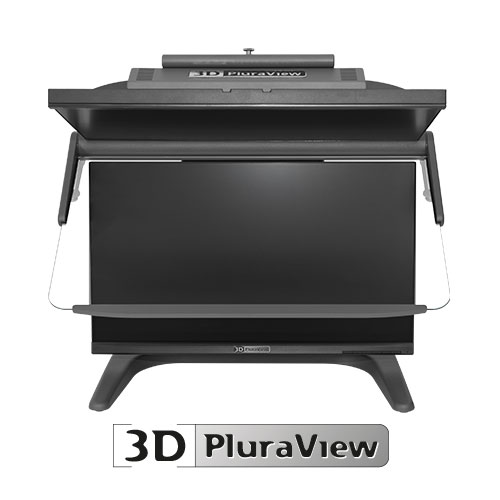
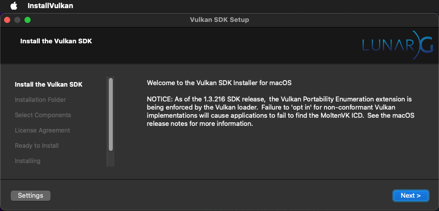
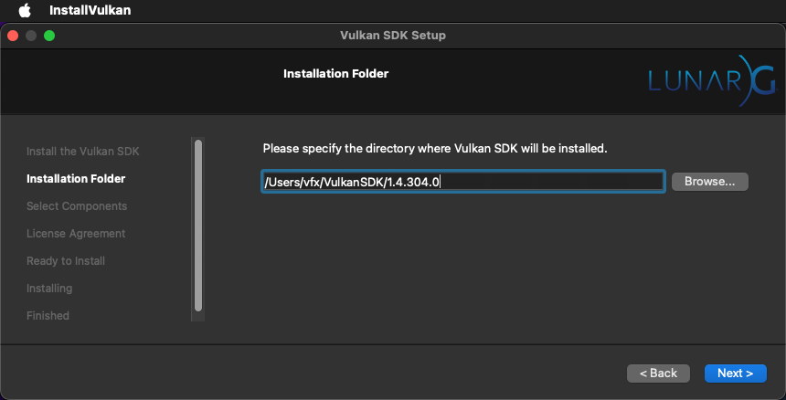

# Monado for macOS Based OpenXR Virtual Devices 

The open-source [Monado](https://monado.dev/) framework makes it possible to display OpenXR rendered real-time stereoscopic 3D content on a passive stereoscopic 3D monitor like the Schneider Digital [PluraView3D display](https://www.3d-pluraview.com/en/). Monado is cross-platform compatible and works on Windows, Linux, and macOS systems. 

On macOS, the "Displays" system panel lists a PluraView3D display's panel as a "Liyama North America 28" monitor.

# Monado on MacOS

GitHub user Max Thomas has shared a [GitHub Gist tip](https://gist.github.com/shinyquagsire23/3c68aecd872cc7ac21c28e950245dbd2#file-macos_building-txt) on getting monado to run on macOS.

## The Monado for macOS CLI (command-line) executable program is located at:

- /usr/local/bin/monado-cli

## Install the homebrew package manager for macOS

	/bin/bash -c "$(curl -fsSL https://raw.githubusercontent.com/Homebrew/install/HEAD/install.sh)"
	
## Add the macOS build tools and supporting libraries using homebrew

	brew install git cmake ninja eigen sdl2 libusb curl ffmpeg x264 nlohmann-json glfw glm glew capnp libx11 libxrandr libxcb xquartz

## Install the [VulkanSDK](https://vulkan.lunarg.com/sdk/home#mac) for macOS using the SDK Installer

For simplicity, it is likely easiest if you place the SDK files into your home folder:

	$HOME/VulkanSDK/

## Download the OpenXR SDK

	{
	git clone https://github.com/KhronosGroup/OpenXR-SDK.git
	cd OpenXR-SDK
	}
	
## Compile OpenXR using Xcode

	{
	cd $HOME/OpenXR-SDK
	mkdir -p build/macos
	cd build/macos
	cmake -G "Xcode" ../..
	xcodebuild -scheme ALL_BUILD build
	}

## Edit your .zshrc file:

	nano $HOME/.zshrc

## Append the following text to the end of your .zshrc file

Update the following .zshrc text snippet to line up with your user account name and the current Vulkan version:

	export VULKAN_SDK=$HOME/VulkanSDK/1.4.304.0/macOS/
	export PATH="$VULKAN_SDK/bin:$PATH"
	export LD_LIBRARY_PATH=$VULKAN_SDK/lib
	export XR_RUNTIME_JSON=$HOME/monado/build/openxr_monado-dev.json

## Compile Monado for macOS

Use the macOS terminal to run the following shell commands:

	{
	git clone --branch macos_ql_merge https://github.com/shinyquagsire23/monado.git
	cd monado && mkdir -p build && cd build
	cmake .. -DXRT_ENABLE_GPL=1 -DXRT_BUILD_DRIVER_EUROC=0 -DXRT_BUILD_DRIVER_NS=0 -DXRT_BUILD_DRIVER_PSVR=0 -DXRT_HAVE_OPENCV=0 -DXRT_HAVE_XCB=0 -DXRT_HAVE_XLIB=0 -DXRT_HAVE_XRANDR=0 -DXRT_HAVE_SDL2=0  -DXRT_HAVE_VT=0 -DXRT_FEATURE_WINDOW_PEEK=0 -DXRT_BUILD_DRIVER_QWERTY=0 -DXRT_BUILD_DRIVER_WMR=0 -DXRT_FEATURE_SERVICE=0 -DXRT_FEATURE_STEAMVR_PLUGIN=0 -DXRT_MODULE_IPC=0
	make
	}

The output from the build process (monado-cli) is stored in:

	$HOME/monado/build/src/xrt/targets/cli/

The cmake install script can be used to install this executable into the folder:

	/usr/local/bin/monado-cli

This is done by running:

	cd $HOME/monado/build/src/xrt/targets/cli/
	sudo cmake -P cmake_install.cmake

When you try to run the CLI program you will get an error:

	% /usr/local/bin/monado-cli
	dyld[28307]: Library not loaded: @rpath/libMoltenVK.dylib
	  Referenced from: <FA22C6D0-6CB8-38A8-B5ED-BDBF8FDF63D3> /usr/local/bin/monado-cli
	  Reason: no LC_RPATH's found
	zsh: abort      /usr/local/bin/monado-cli

You can fix the LC_RPATH error using:

	sudo install_name_tool -add_rpath "$VULKAN_SDK/lib/" /usr/local/bin/monado-cli

Now the monado-cli executable works as expected:

	% monado-cli
	Monado-CLI 0.0.1
	Usage: monado-cli command [options] [file]
	
	Commands:
	  test       - List found devices, for prober testing.
	  probe      - Just probe and then exit.
	  lighthouse - Control the power of lighthouses [on|off].
	  calibrate  - Calibrate a camera and save config (not implemented yet).
	  calib-dumb - Load and dump a calibration to stdout.
	  slambatch  - Runs a sequence of EuRoC datasets with the SLAM tracker.

You can run the Monado Test command using:

	monado-cli test

The Monado Test output in the terminal is:

	% monado-cli test
	 :: Creating instance!
	 :: Probing!
	 :: Dumping!
		  0: 0x096e:0x0201
			ptr:              0x14b606720
			usb_dev_class:    00
			usb.bus:          2
			usb.addr:         2
			port:             1
			libusb:           0x600001ebc540
		  1: 0x1235:0x8006
			ptr:              0x14b6067b8
			usb_dev_class:    00
			usb.bus:          2
			usb.addr:         1
			port:             3
			libusb:           0x600001ebc4e0
	 :: Creating system devices!
	 INFO [p_create_system] Creating system:
		Builders:
			simulated: Simulated devices builder
			legacy: Legacy probing system
		No builder selected in config (or wasn't compiled in)
		No builder was certain that it could create a head device
		Selected legacy because it maybe could create a head
		Using builder legacy: Legacy probing system
		Got devices:
			0: Simulated HMD
		In roles:
			head: Simulated HMD
			left: <none>
			right: <none>
			gamepad: <none>
			eyes: <none>
			hand_tracking.left: <none>
			hand_tracking.right: <none>
		Result: XRT_SUCCESS
	 :: Listing created devices!
		 0: Simulated HMD
	 :: Listing role assignments!
		head:                Simulated HMD
		left:                <none>
		right:               <none>
		gamepad:             <none>
		hand_tracking.left:  <none>
		hand_tracking.right: <none>
	 :: All ok, shutting down.
	 :: Exiting '0'

You can run the Monado Probe command using:

	monado-cli probe

The Monado Probe output in the terminal is:

	% monado-cli probe
	 :: Creating instance!
	 :: Creating system devices!
	 INFO [p_create_system] Creating system:
		Builders:
			simulated: Simulated devices builder
			legacy: Legacy probing system
		No builder selected in config (or wasn't compiled in)
		No builder was certain that it could create a head device
		Selected legacy because it maybe could create a head
		Using builder legacy: Legacy probing system
		Got devices:
			0: Simulated HMD
		In roles:
			head: Simulated HMD
			left: <none>
			right: <none>
			gamepad: <none>
			eyes: <none>
			hand_tracking.left: <none>
			hand_tracking.right: <none>
		Result: XRT_SUCCESS
	 :: Regular built in drivers
		quest_link
		Simulated
	 :: Additional built in drivers
	 :: Destroying probed devices
	 :: All ok, shutting down.
	 :: Exiting '0'

## Extra Tips

### Monado Based Simulator OpenXR Display Canvas Resolution

If you want to change the default resolution of a Monado OpenXR HMD screen, you can edit the following lines of code in the file named "r\_hmd.c":

	// Setup info.
	struct u_device_simple_info info;
	info.display.w_pixels = 3840*2;
	info.display.h_pixels = 2160;

### CMAKE_C_COMPILER Compiler Issue

When running cmake on macOS, if you get the following error:

	-- The CXX compiler identification is unknown
	CMake Error at CMakeLists.txt:22 (project):
	  No CMAKE_C_COMPILER could be found.

Try solving it by running:

	sudo xcode-select --reset

### libopenxr_monado.dylib Compiling Issue

If you get a Monado compiling error for:

	error:
	[ 83%] Linking CXX shared library libopenxr_monado.dylib
	ld: warning: ignoring duplicate libraries: '../../auxiliary/math/libaux_math.a', '../../auxiliary/os/libaux_os.a', '../../auxiliary/util/libaux_util.a', '../../auxiliary/vk/libaux_vk.a', '../../state_trackers/prober/libst_prober.a', '../common/libtarget_lists.a'
	Undefined symbols for architecture arm64:
	  "_ql_xrsp_sidechannel_eye_l_orient", referenced from:
		  <initial-undefines>
	  "_ql_xrsp_sidechannel_eye_r_orient", referenced from:
		  <initial-undefines>
	ld: symbol(s) not found for architecture arm64
	c++: error: linker command failed with exit code 1 (use -v to see invocation)
	make[2]: *** [src/xrt/targets/openxr/libopenxr_monado.dylib] Error 1
	make[1]: *** [src/xrt/targets/openxr/CMakeFiles/openxr_monado.dir/all] Error 2
	make: *** [all] Error 2

You can still force the generation of the CLI using:

	cd $HOME/monado/build/src/xrt/targets/cli/
	make
