# Using OpenVR With Stereo3D Displays

- Document prepared by: Andrew Hazelden

## Overview

A library called "[VRto3D](https://github.com/oneup03/VRto3D)" allows you use OpenVR compatible software with an Acer SpatialLabs "Simulated Reality" display, or a passive stereo 3D display. This works by emulating an HMD (Head Mounted Display) device using a virtual framebuffer.

VRto3D can playback visuals from an immersive VR program as a Half-SBS formatted image in a fullscreen mode on an Acer SpatialLabs monitor. This technique allows OpenVR based software like BMD Fusion Studio and Resolve Studio to work with the Acer SpatialLabs display.

## Acer 3D Mode

The Acer SpatialLabs Experience Center includes a "3D mode" hotkey (Alt+G) that allows you to take an onscreen SBS (Side by Side) formatted fullscreen program's visual content and have it live-weaved into the diagonal interlacing patten the display needs. This "3D mode" is disabled using the (Alt+T) hotkey.

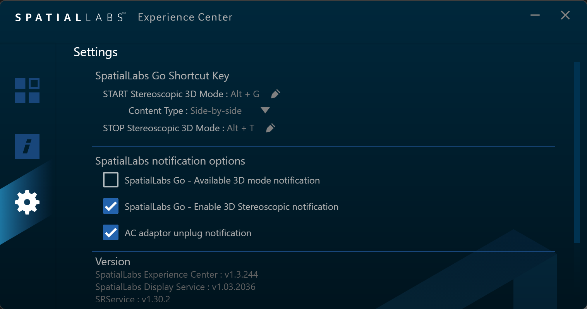

## Installing VRto3D

1. Follow the "[SpatialLabs Unlocked](https://kartaverse.github.io/OpenDisplayXR/#/guides/Acer_SpatialLabs_Display/SpatialLabs_Unlocked)" guide to allow the SpatialLabs display to work outside of a true fullscreen graphics mode, and to stay in the 3D mode in a persistent fashion.

2. Install [Steam](https://store.steampowered.com/) and [SteamVR](https://store.steampowered.com/app/250820/SteamVR/) for Windows.

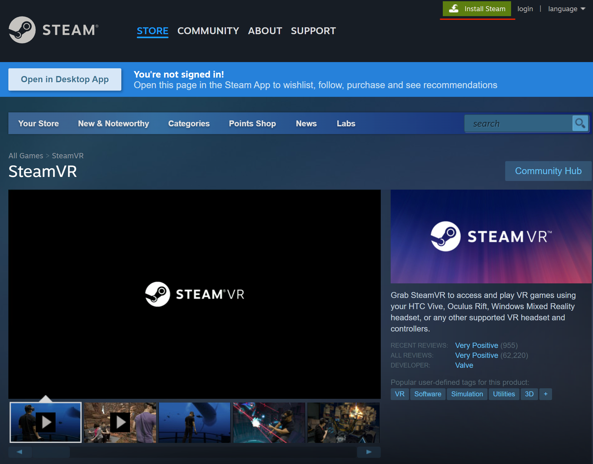

3. Download the latest version of VRto3D library from the project's [VRto3D GitHub releases page](https://github.com/oneup03/VRto3D/releases). This tool is an OpenVR compatible virtual HMD device driver that creates a simulated SBS stereo graphics framebuffer. It is capable of working with an Acer SpatialLabs display, and with passive stereo 3D monitors, too.

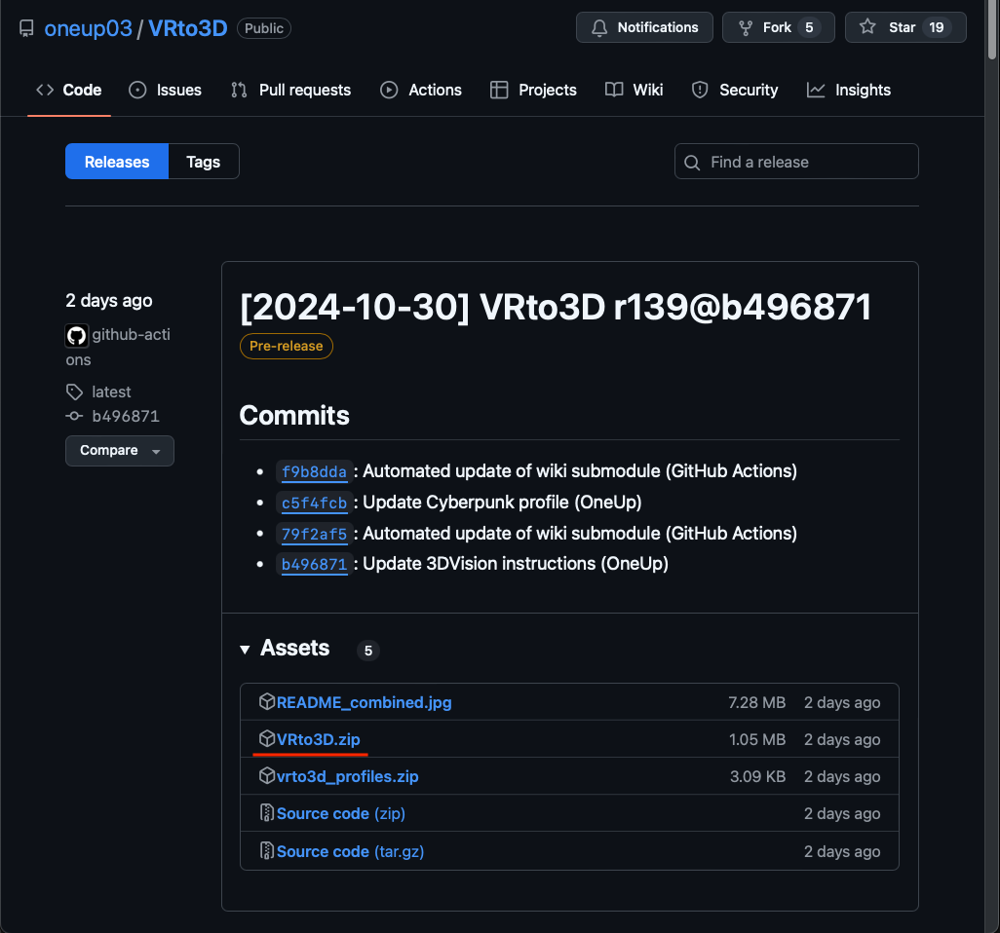

4. Unzip the "VRto3D.zip" archive. For more information about the library check out the included "[README.md](https://github.com/oneup03/VRto3D/blob/main/README.md)" file. This README file has details about the input mapping and extra settings you can configure.

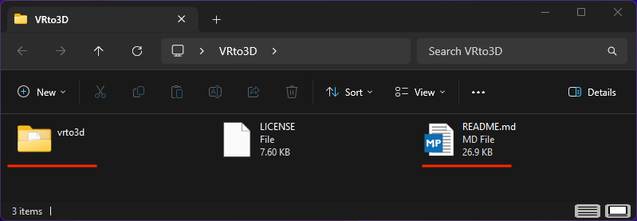

5. Install the VRto3D HMD driver by copying the "vrto3d" folder into the SteamVR drivers folder:

			C:\Program Files (x86)\Steam\steamapps\common\SteamVR\drivers\

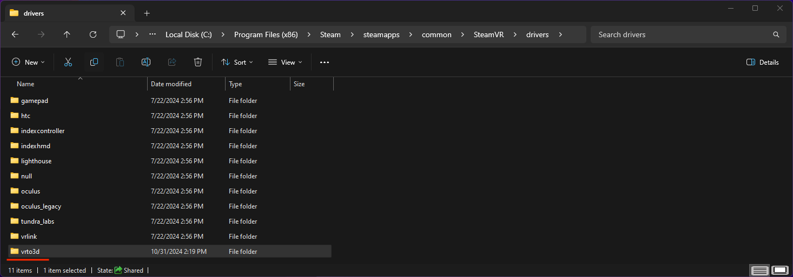

6. Use an Explorer folder browser window to create the preference sub-folders where the SteamVR configuration file is stored:

			C:\Users\<Your User Account>\Documents\My Games\vrto3d\

7. Open Steam and launch the SteamVR executable once to create the "default_config.json" preference file. Quit SteamVR.

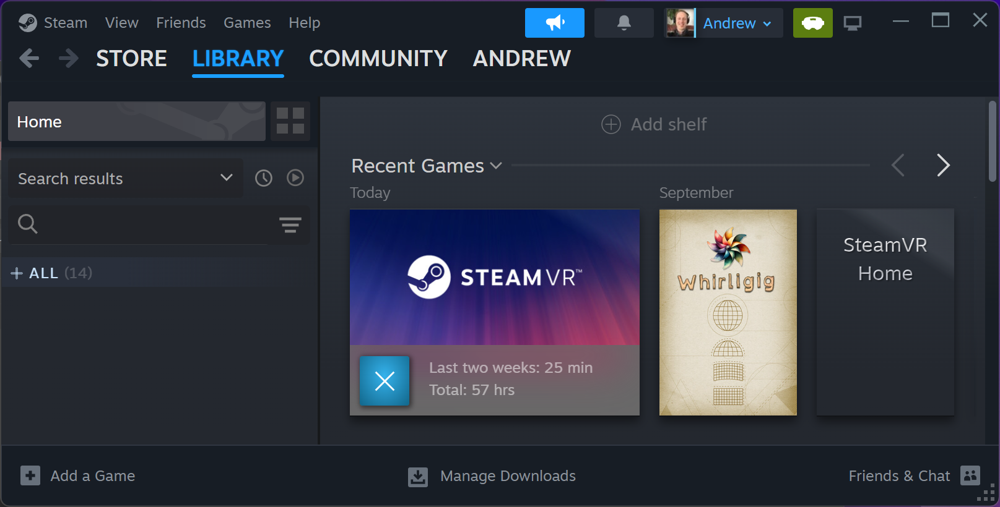

8. Open the newly created "default_config.json" preference file up in a programmer's text editor like Notepad++ or VSCode. We need to adjust the values so the monitor output is rendered using a SpatialLabs "Half SBS" resolution setting:

			C:\Users\<Your User Account>\Documents\My Games\vrto3d\default_config.json

9. Modify the following settings so the 3D graphics are formatted for the SpatialLabs display panel native resolution:

			"window_width": 3840,
			"window_height": 2160,
			"render_width": 1920,
			"render_height": 2160,

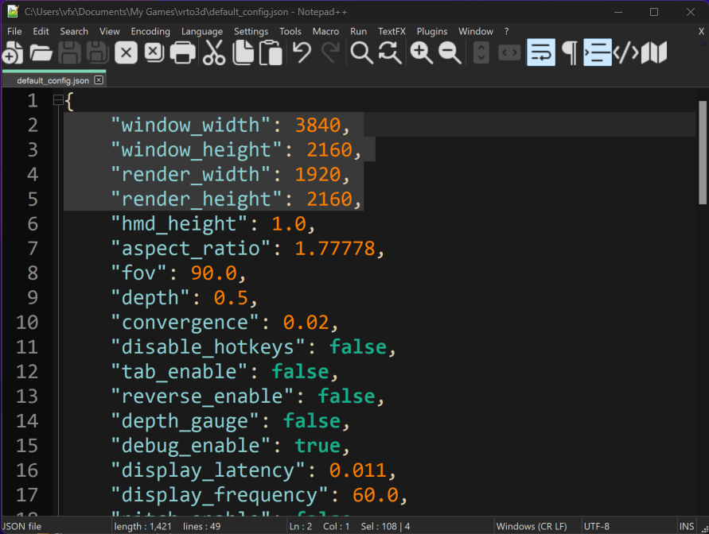

10. Restart SteamVR again so the settings take effect. If you see a SteamVR Headset Notice dialog that says "SteamVR has detected your headset is running as a monitor. For best results switch to Direct Display mode", click the "Dismiss" button to continue.

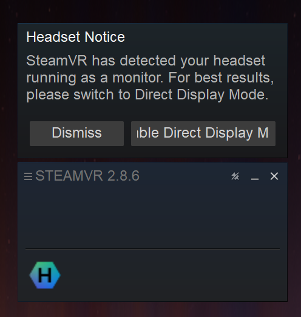

11. Now launch a program like BMD Fusion Studio. Load a Fusion .comp that has a 3D scenegraph with detailed geometry in it. Select the HMD output display mode on one of the 3D nodes. 

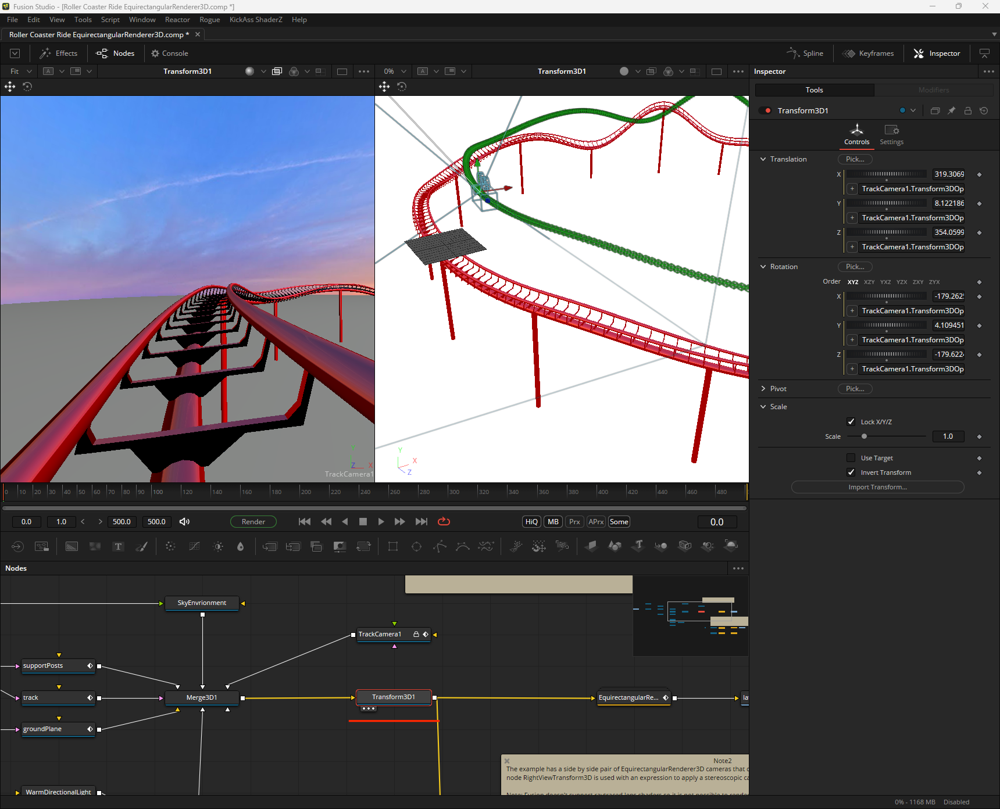

SteamVR will launch and the content will appear in a fullscreen "SBS 3D" window. You can hide the "Fusion VR Mirror" window.

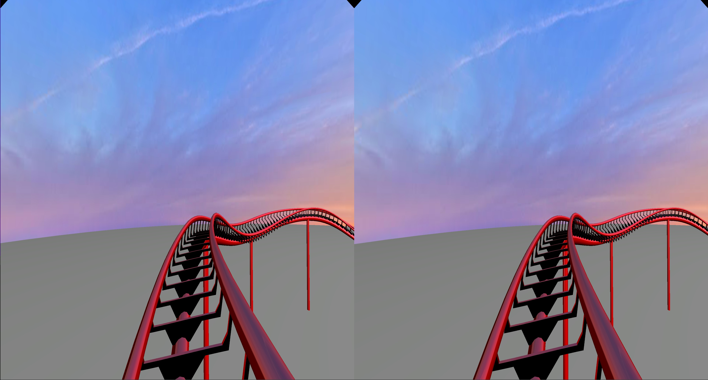

12. The SpatialLabs Experience "Alt+G" hotkey can be used to encode the SBS stereo content into the displays native "weaved" output for glasses free 3D viewing. When you want to exit this 3D mode session press the SpatialLabs Experience "Alt+T" hotkey.

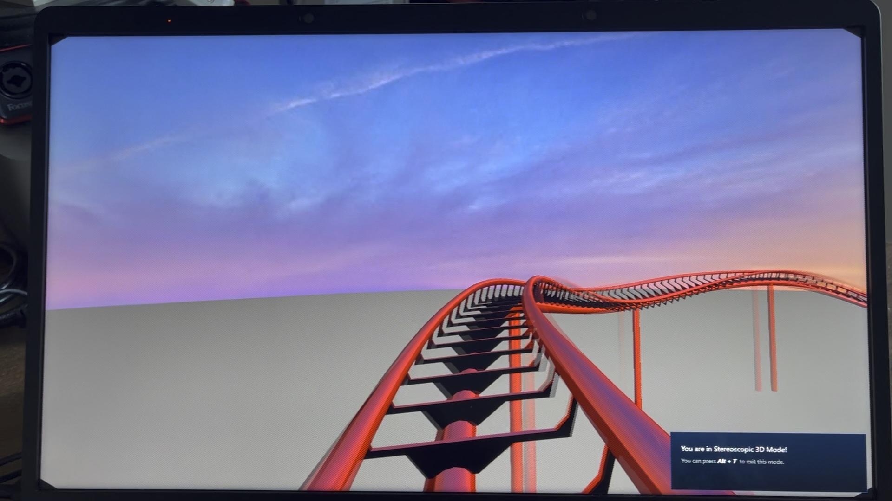