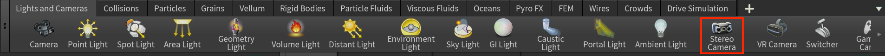
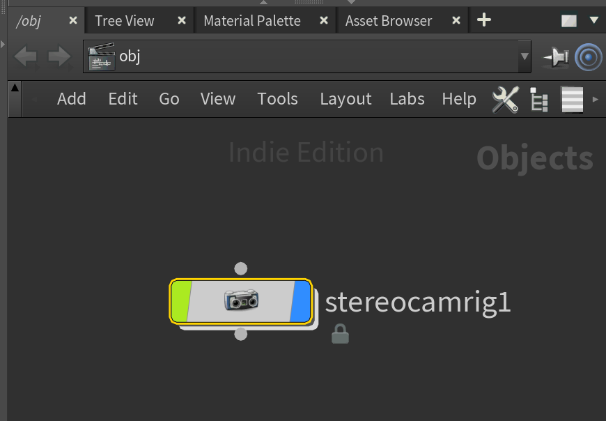
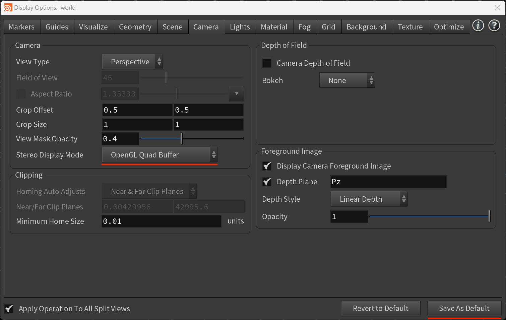
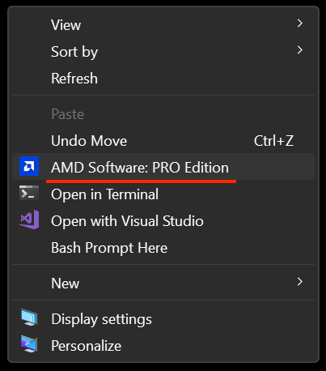
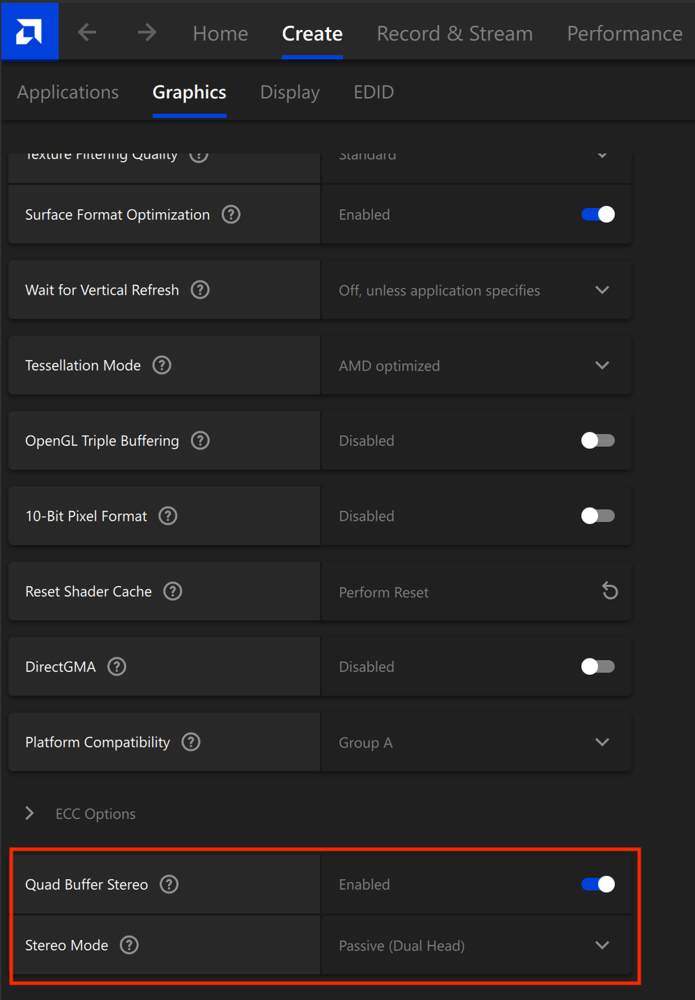
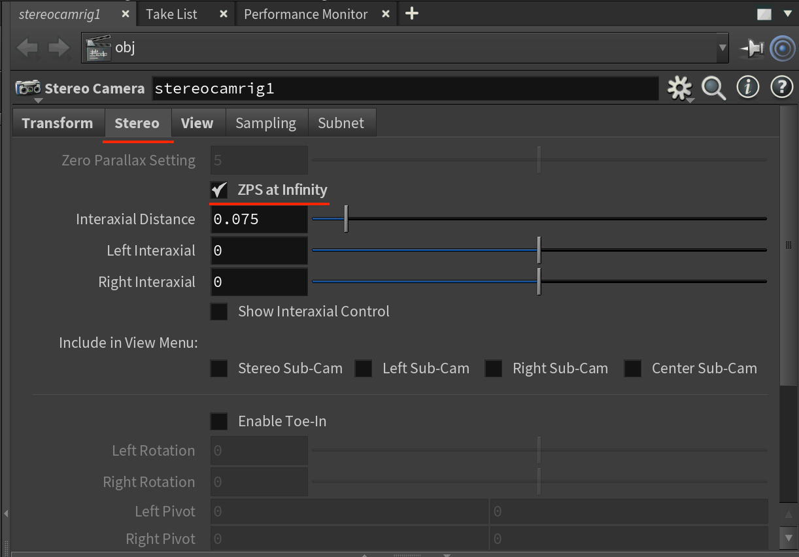
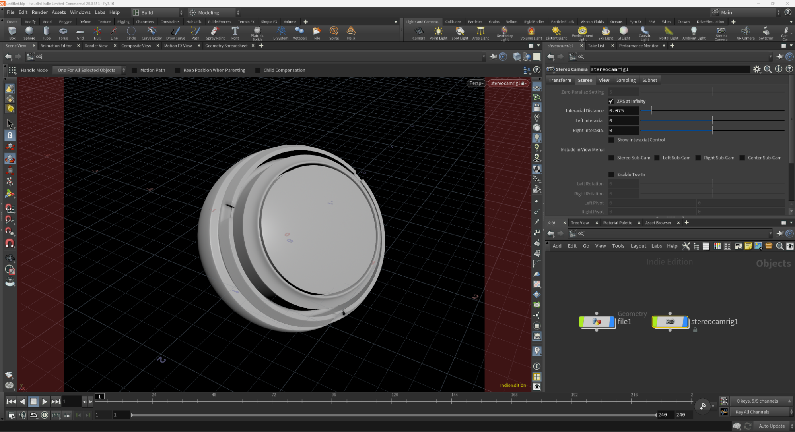

# Quadbuffer Stereo in SideFX Houdini

# Overview

This guide covers how to enable Quadbuffer stereo 3D support in Houdini 20. This allows active and passive stereo 3D displays to be used with the interactive viewport windows in Houdini.

# Step By Step

1\. Switch to the "Lights and Cameras" shelf in Houdini. This is typically found at the top right of the Houdini user interface.

Hold down the Control button on your keyboard and click on the "Stereo Camera" shelf item to add a new stereo camera rig to the OBJ context.

2\. Click in the 3D viewport window and press the "D" key to show the "Display Options" window. Switch the "Camera" tab. On the left side of the window is a Camera section. Change the "Stereo Display Mode" to "OpenGL Quad Buffer". Click the "Save as Default" button to close the window.

Note: If you are working in the Solaris context you will also have to define the same "Stereo Display Mode" setting again in the "Display Options" dialog.

If you don't see "OpenGL Quad Buffer" as an option in Houdini's "Display Options", or there is an issue viewing the stereo 3D content, open up your Windows OS based AMD or NVIDIA GPU driver control panel and validate the settings.

For AMD Radeon Pro GPUs you need to open up the "AMD Software: Pro Edition" window which is accessible by right-clicking on your Windows desktop pattern.

In the AMD GPU window navigate to the "Create \> Graphics" section. Scroll down in the Graphics options to "Quad Buffer Stereo" and set it to "Enabled". Then set the "Stereo Mode" to "Passive (Dual Head)". You might need to reboot Windows in order to activate the Quad Buffer Support.

3\. Back in Houdini, select the "stereocamrig1" node in the OBJ context, and look at the parameters section. Activate the "Stereo" tab on that node. The "ZPS at Infinity" checkbox is used to set the "Zero Parallax Setting" to the furthest distance in the scene. This will adjust the stereo 3D convergence value so the models in the 3D viewport appear to pop-out of the display.

4\. Let's add some geometry to the scene. Click on the Objects view and press the TAB icon to add a "File" node. Double click on the center of the node shape to move inside the group hierarchy. 

Select the file1 object and then define the 3D model you would like to load using the "Geometry File" attribute in the Parameters view. You can select a polygon model using a standard 3D model format like Alembic (.abc), Wavefront OBJ (.obj), Pixar OpenUSD (.usd, .usdc, .usdz, .usda), etc.

When you put on your stereo 3D glasses you can now view the imported polygon model in native stereoscopic 3D.

