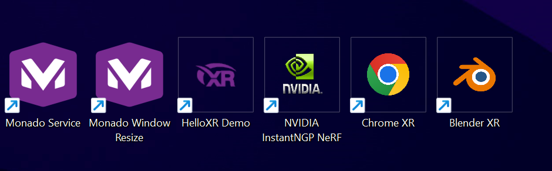
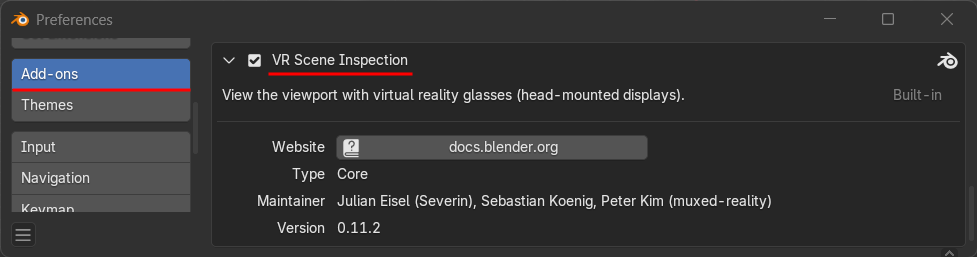

# **Using Blender with OpenXR Stereo 3D Displays**

Blender is a popular open-source 3D animation toolset that supports the OpenXR framework for VR device connectivity. This [Blender OpenXR support](https://docs.blender.org/manual/en/4.1/addons/3d_view/vr_scene_inspection.html) makes it possible to use Blender with passive stereo 3D displays using the Monado OpenXR runtime.

1\. Download the current Blender 4.x release for Windows x64:  
[https://www.blender.org/download/](https://www.blender.org/download/)

To install the Blender 3D software onto your PC, you need to run the installer program named "blender-\<version\>-windows-x64.msi".

If you are just getting started with the Blender software for the first time, you can stick with the default settings when you run the Blender setup program.

2\. Download the OpenDisplayXR project's version of the Mondao OpenXR runtime that has been customized for use with passive stereo 3D displays.

3\. Extract and install the Monado files to the base folder on your hard drive:

	C:\OpenDisplayXR\

The included "0\_create\_desktop\_shortcuts.bat" script makes it easy to add several Monado related shortcuts to your desktop folder and to the Windows OS Start menu.

4\. There is a bundled 3DConnexion SpaceMouse 3DxWare setting file provided for use with Monado. It is found on disk at:

	C:\OpenDisplayXR\extras\3Dconnexion 3DxWare\3DxMonado.zip

After you expand the 3DxMonado.zip file, you will be able to access the 3DxWare preference file named "3DxMonado.3dxz". This setting file can be imported by clicking on the "More \> " button in the 3DxWare utility program.

5\. At the moment the OpenXR stereoscopic 3D support is achieved using an extended desktop based output mode.

The two PluraView3D display panels need to be arranged in a horizontal layout in the Windows operating system's "System \> Display" settings. You can flip the left and right eye ordering by re-positioning display 1 and 2\.

6\. Start the Monado runtime service shortcut on your desktop. This will register Monado as an OpenXR runtime.

7\. Launch Blender using the new shortcut on your desktop.

8\. After Blender has finished loading, select the "Edit \> Preferences" menu item. In the "Blender Preferences" window, click on the Add-ons sidebar item. Then enable the checkbox by the "3D View: VR scene Inspection" addon.

Open the "View \> Sidebar" menu in the 3D viewport.

Select the VR tab.

In the "VR Session" tab, click on the "Start VR Session" button.

If the Monado Service is running you will now see a stereo 3D viewport.  

If the Monado Service is not running you will see the following message at the bottom of the Blender user interface:

	"Failed to connect to an OpenXR runtime"

9\. The Monado viewport window content is navigated using the Monado Qwerty interface palette. You can resize the window to be more compact. It's helpful to expand the "Qwerty HMD" control section and set the hmd.movement\_speed parameter to "0.25" so the Blender 3D viewport navigation speed is correct when using a SpaceMouse.

This is what an "extended mode" desktop stereo 3D session looks like in Blender with the Monado Qwerty window floating in the foreground.

Note: You may have to adjust the Windows firewall rules to allow the "Monado Service" program to communicate locally with the other Monado utilities on your computer.
